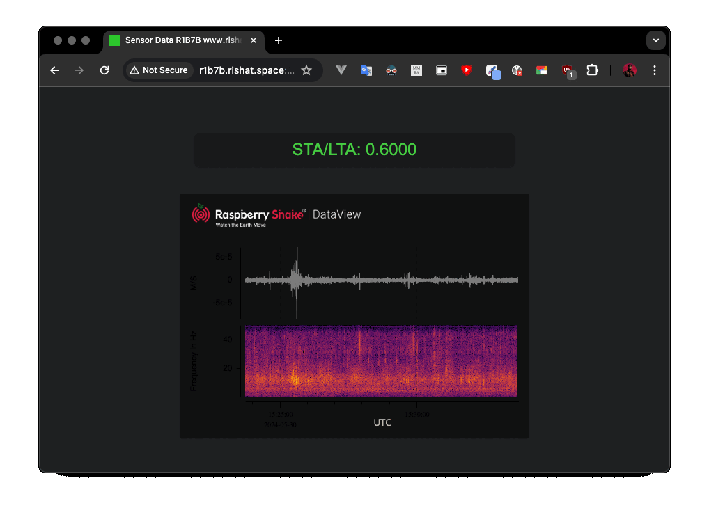

# Sensor Data Web Application

This is a simple web application that reads sensor data from a UDP port and displays it on a web page in real-time with color coding based on STA/LTA values.



## Requirements

- Go 1.22 or later
- A web browser

## Installation

1. Clone the repository:

```sh
git clone https://github.com/kazquake/presenter.git
cd r1b7b
```

2. Install necessary Go packages:

```sh
go get github.com/gorilla/websocket
```

## Usage

1. Place your `index.html` file inside the `static` directory:

```
sensor-data-webapp/
├── static/
│   └── index.html
└── main.go
```

2. Run the Go server:

```sh
go run main.go
```

3. Open your web browser and navigate to `http://localhost:8080` to view the real-time sensor data.

## How It Works

- The Go server listens for UDP data on port 500(1-9)(data from rsudp https://github.com/kazquake/rsudpreader).
- Incoming sensor data is broadcast to all connected clients via WebSocket.
- The web page updates the displayed sensor data in real-time and applies color coding based on predefined ranges.

## HTML Example

Here's an example of the `index.html` file:

```html
<!DOCTYPE html>
<html lang="en">
<head>
    <meta charset="UTF-8">
    <meta name="viewport" content="width=device-width, initial-scale=1.0">
    <title>Sensor Data</title>
    <style>
        .data {
            font-size: 24px;
            margin: 20px;
        }
    </style>
</head>
<body>
    <div id="data" class="data">Waiting for data...</div>

    <script>
        const ws = new WebSocket("ws://" + location.host + "/ws");

        ws.onmessage = function(event) {
            const data = parseFloat(event.data);
            const dataDiv = document.getElementById('data');

            let color;
            if (data < 0.2) {
                color = 'blue';
            } else if (data < 0.4) {
                color = 'cyan';
            } else if (data < 0.8) {
                color = 'limegreen';
            } else if (data < 1.5) {
                color = 'yellow';
            } else if (data < 4.0) {
                color = 'orange';
            } else if (data < 12.0) {
                color = 'magenta';
            } else if (data < 30.0) {
                color = 'purple';
            } else if (data < 60.0) {
                color = 'red';
            } else {
                color = 'darkred';
            }

            dataDiv.style.color = color;
            dataDiv.textContent = `Sensor data: ${data.toFixed(4)} µm/s`;
        };

        ws.onclose = function() {
            document.getElementById('data').textContent = "Connection closed";
        };
    </script>
</body>
</html>
```

## Handling Errors

In case you encounter the error `write: broken pipe`, the server now handles this by removing closed connections from the active WebSocket connections list to avoid logging this error repeatedly.

## License

This project is licensed under the MIT License.
